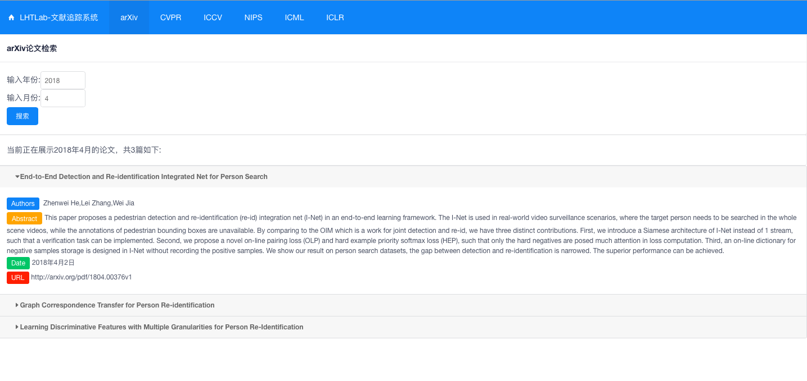

# LHTLab_PaperTracking
A paper tracking system which collects paper from CVPR,ICCV,ICML,ICLR,NIPS and arXiv and displays the results on web.



Dependencies:
Python 2.7 and Scrapy 1.5.0(for crawlers), MySQL 5.7(for data storage), NodeJS 8.11.0(for front-end display)

To get started:
First, create a MySQL database named `academic`. Then, import table structure from `academic.sql` into this database.

Then, run 6 crawlers under dlpapercollector folder respectively. You can change some parameters to collect more/less papers from arXiv.
Finally, cd web and run
```bash
npm install
node app
```
You can see the results in http://localhost:3000. To show papers other than the person-reid topic, please modify SQLs in `app.js` by yourself.

For server usage, please run
```bash
npm install -g forever
forever start app.js
```
to start the application and run
```bash
forever stop app.js
```
to stop it elegantly.

Update on 2018.04.12:
1. Updated the function of selecting fields.(e.g.: Person re-id/GAN)
2. Added pagination.
3. Rewrite html template structure.

Note that 
1. the current website is a little bit slow, this problem will be fixed in the future.
2. You may need to modify something about the MySQL config by yourself.

All rights reserved by LHT's Lab, SJTU.